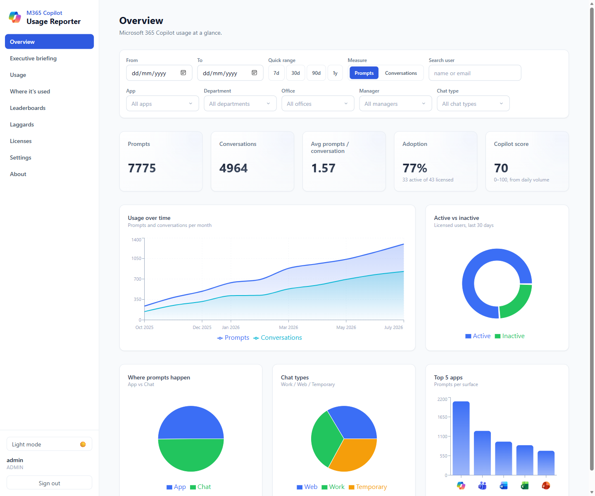
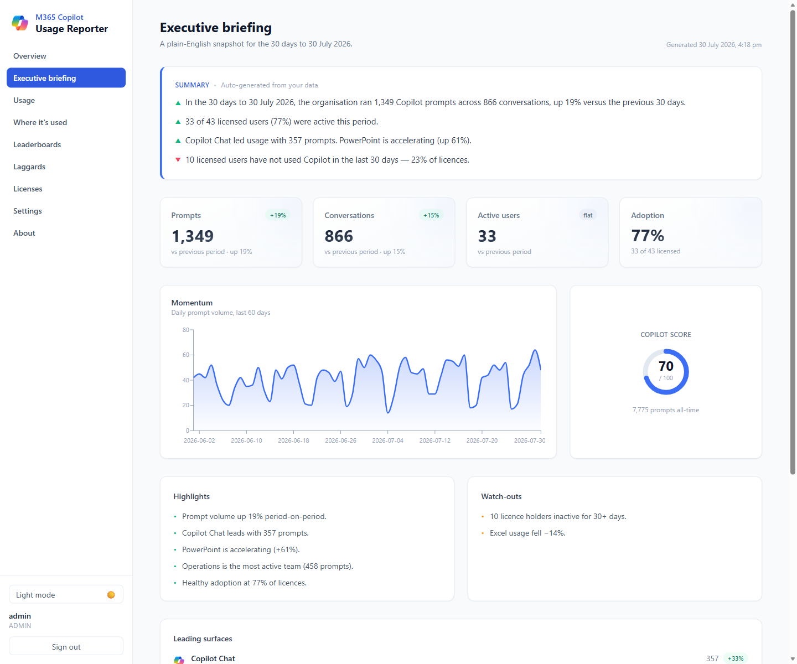
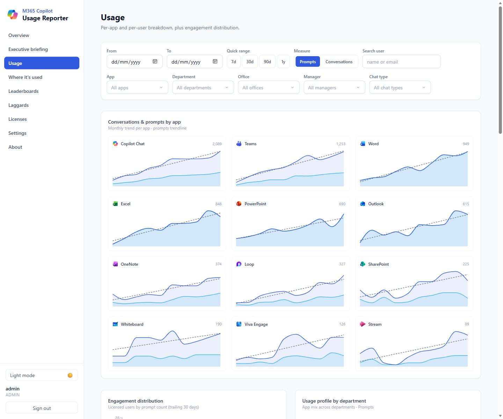
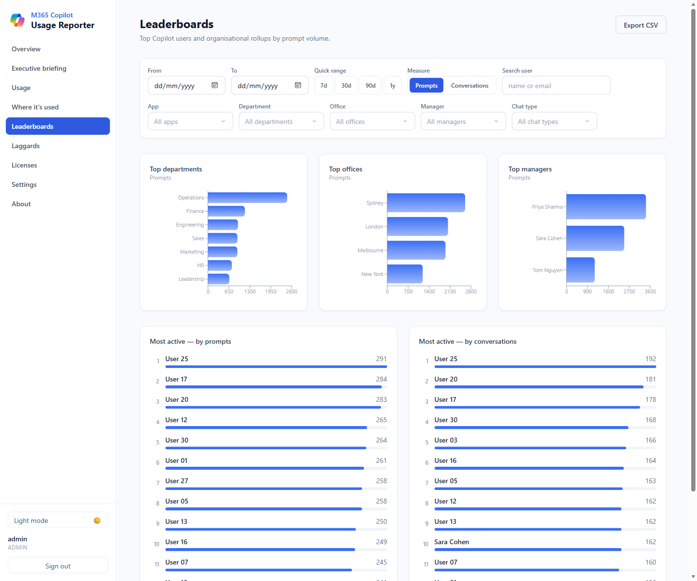
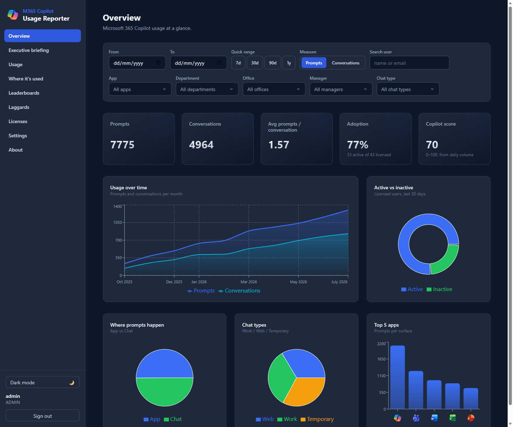

# M365 Copilot Usage Reporter (containerised)

A self-contained, containerised replacement for a Power Platform + Power BI solution. It ingests
Microsoft 365 Copilot usage from Microsoft Graph (app-only / client credentials), stores it in
PostgreSQL, computes metrics, and serves a web dashboard. Runs anywhere via Docker and deploys to
Azure Container Apps.

## Deploy to Azure (one click)

[](https://portal.azure.com/#create/Microsoft.Template/uri/https%3A%2F%2Fraw.githubusercontent.com%2Floryanstrant%2FM365Copilot-Usage-Reporter%2Fmain%2Finfra%2Fazuredeploy.json/createUIDefinitionUri/https%3A%2F%2Fraw.githubusercontent.com%2Floryanstrant%2FM365Copilot-Usage-Reporter%2Fmain%2Finfra%2FcreateUiDefinition.json)

The button provisions everything into a resource group of your choice: a PostgreSQL flexible
server, a Container Apps environment, and the **api** + **worker** container apps (pulled as
prebuilt public images from GitHub Container Registry). You only enter an **admin password** — the
database password and encryption keys are generated for you. When the deployment finishes, open the
`dashboardUrl` output, sign in, and complete the in-app **Settings** to connect Microsoft Graph.

> **Maintainers:** the button relies on public images. After the first run of the
> **Publish container images** workflow, set both GHCR packages
> (`m365copilot-usage-reporter/api` and `.../worker`) to **Public** once, so Container Apps can pull
> them anonymously. See [`docs/deploy.md`](docs/deploy.md) for the full walkthrough.

## After it's deployed

**1. Open the dashboard.** In the portal, go to your resource group → open the deployment (or
Deployments → the `Microsoft.Template` run) → **Outputs** → copy **`dashboardUrl`**. That is your app.
It's served by the **`…-api-…`** Container App (the `…-worker-…` one has no web UI — it just runs
ingestion in the background). You can also get the URL from the api Container App's **Overview →
Application Url**.

**2. Sign in.** Username is what you set as **admin username** (default `admin`); password is the
**admin password** you chose at deploy time.

**3. Connect Microsoft Graph.** Go to **Settings**. The first-run wizard walks you through creating
an Entra **app registration** with the two application permissions
(`AiEnterpriseInteraction.Read.All`, `Directory.Read.All`, admin-consented) and a client secret.
Paste **Tenant ID**, **Client ID**, **Client secret**, then **Test connection**.

**4. Load data.** Click **Refresh now** for the last 24 hours, or open **Backfill** to pull history
(default 30 days). The **Data status** card on Settings shows Prompts / Conversations / **Licensed
users** / Directory users; the **Backfill** page has a run history table with per-run stats.

### Enabling Entra ID single sign-on (optional)

By default the dashboard is protected by the single admin password. You can additionally let
colleagues sign in with their **work account** (read-only viewer role) via **Container Apps Easy
Auth** — administration stays behind the password. You can turn this on **at deploy time or later**.

**One-time prerequisite (either path):** an Entra **app registration** for sign-in (you can reuse
the reporter's own). Note its **Application (client) ID**, create a **client secret**, and after
deployment add the redirect URI
`https://<your-dashboardUrl>/.auth/login/aad/callback` under **Authentication → Web**. If you plan to
restrict viewers to a security group, also add a **groups** claim under **Token configuration**.

**Option A — at deploy time (recommended):** on the **Deploy to Azure** form, open the
**Authentication** tab and set **Enable Entra ID single sign-on = Yes**, then paste the app
registration **client ID**, **client secret**, and (optional) **tenant ID**. Everything is wired up
automatically; grab the **`entraRedirectUriToRegister`** deployment output and add it to the app
registration as above.

**Option B — after deployment:** open the **`…-api-…`** Container App → **Settings →
Authentication** → **Add identity provider** → **Microsoft**, use your app registration's client ID
+ secret, and set *unauthenticated requests* to **Allow** (the app still gates admin behind the
password; SSO users become viewers). Add the redirect URI as above.

Either way, once enabled the sign-in page shows a **"Sign in with Microsoft"** button and returning
users are signed in silently. To restrict who may view, set a **report access group** on the
**Settings** page — only members of that Entra group are admitted.

Full details and screenshots: [`docs/deploy.md`](docs/deploy.md#entra-single-sign-on-optional).

### Where to find run history, logs, and errors

- **In the app:** **Settings → Data status** (last run + counts) and **Backfill** (per-run history
  table with prompts/lookback/status). A failed run shows its error message in the run's stats.
- **Container logs (the real detail):** manual **Refresh now** and **Backfill** run inside the
  **`…-api-…`** Container App, so their logs live there — open it → **Monitoring → Log stream**
  (live), or **Logs** to query `ContainerAppConsoleLogs_CL`. The scheduled background ingest runs in
  the **`…-worker-…`** Container App — check its log stream for scheduled-run errors.
- **A run that "completes instantly with no data" almost always means zero Copilot-licensed users
  were found** (nothing to query). Check **Settings → Data status → Licensed users**, or the
  **Copilot-licensed users** number shown by **Test connection**. If it's 0, the configured Copilot
  **SKU ID** doesn't match any assigned licences in the tenant — set the correct SKU under Settings →
  *Copilot SKU IDs* (the default is Microsoft 365 Copilot, `639dec6b-bb19-468b-871c-c5c441c4b0cb`).

## Screenshots

### Overview

At-a-glance KPIs, usage over time (prompts vs conversations, by month), and the top surfaces.



### Executive briefing

A plain-English, auto-generated snapshot with period-over-period deltas, highlights, watch-outs, and
suggested actions.



### Usage

Per-app monthly trends (with trendlines and product logos), engagement distribution, and sortable
per-app / per-user tables.



### Leaderboards

Top departments, offices, and managers, plus the most active users by prompts and conversations.



### Dark mode

Every page supports a light and dark theme.



## Terminology

Microsoft Graph uses "session" and "interaction". This project renames them everywhere:

| Microsoft Graph        | This project                    |
| ---------------------- | ------------------------------- |
| session / `sessionId`  | **Conversation** / `conversation_id` (count = **Conversations**) |
| interaction / `id`     | **Prompt** / `prompt_id` (count = **Prompts**) |

The words "session" and "interaction" never appear in the API, database, or UI.

## Stack

- **Backend / engine:** Python 3.12, FastAPI, SQLAlchemy 2.x (async), Alembic, httpx, MSAL,
  APScheduler, Pydantic v2, psycopg v3.
- **Database:** PostgreSQL 16 (schema via Alembic).
- **Frontend:** React + Vite + TypeScript + Tailwind + Recharts (ECharts for advanced visuals).
- **Packaging:** Docker + docker-compose. Deploy: `azd` + Bicep → Azure Container Apps.

## Repo layout

```
/api         FastAPI: routes, auth, metrics, serves built frontend
/worker      ingestion engine: Graph client, transforms, scheduler, backfill
/shared      SQLAlchemy models, db session, config, crypto (shared by api+worker)
/frontend    React + Vite app
/infra       Bicep + azure.yaml (azd)
/tests       pytest
docker-compose.yml
.env.example
```

## Quick start (local)

```powershell
# 1. Create your env file and a Fernet key
Copy-Item .env.example .env
python -c "from cryptography.fernet import Fernet; print(Fernet.generate_key().decode())"
# paste the printed value into FERNET_KEY in .env

# 2. Start the full stack (api + worker + postgres + frontend)
docker compose up --build
```

- **Dashboard (web UI):** http://localhost:5173
- **API + Swagger docs:** http://localhost:8000/docs
- **API health check:** http://localhost:8000/health
- **Postgres:** localhost:5432 (user/pass/db all `copilot` by default)

On first start an admin login is seeded from `ADMIN_USERNAME` / `ADMIN_PASSWORD`
in `.env` (defaults `admin` / `change-me` — change these). Sign in at the
dashboard, open **Settings**, enter your Graph credentials, **Test connection**,
then **Run ingest now** (or **Run backfill** for history).

## Features

- **Overview** — KPI cards (Prompts, Conversations, avg prompts/conversation,
  adoption) plus trend, active-vs-inactive, and usage-by-app charts.
- **Usage** — per-app and per-user tables (CSV export) + engagement buckets.
- **Leaderboards** — top users by prompts and conversations.
- **Licenses** — enabled/allocated/available over time.
- **About** — data freshness + methodology.
- **Settings (admin)** — Graph config (secret write-only, Fernet-encrypted),
  a **guided app-registration setup wizard**, test connection, run ingest,
  resumable **backfill** with live progress.
- **Entra single sign-on (optional)** — Container Apps Easy Auth lets licensed
  users view the report with their work account (read-only), optionally gated to
  an Entra security group. Admin stays password-protected. See
  [docs/deploy.md](docs/deploy.md#entra-single-sign-on-optional).
- Global date-range/app **filters**, **CSV export**, and a **light/dark** theme.

## Running tests

```powershell
pip install -e ".[dev]"
pytest
```

Tests run against an isolated SQLite database (no Postgres required). Inside the
running stack you can also run `docker compose exec api python -m pytest`.

## First-run checklist

1. `docker compose up` (or `azd up`).
2. Sign in at http://localhost:5173 with `ADMIN_USERNAME` / `ADMIN_PASSWORD`
   (seeded automatically on first start).
3. **Settings** → follow the guided setup wizard to create the app registration,
   then enter Tenant ID, Client ID, Client Secret, confirm the Copilot
   SKU id(s), set the backfill window and (optionally) schedule + report-access group.
4. **Test connection** → **Run ingest now** (or start **Backfill**) → watch progress.
5. Explore the dashboard.

The Graph app registration needs application permissions
`AiEnterpriseInteraction.Read.All` and `Directory.Read.All` (admin-consented).

## Deploy to Azure (azd)

Prefer building from source? Infrastructure (Container Apps Environment, api + worker container apps,
PostgreSQL Flexible Server, Container Registry, Log Analytics) is defined in `/infra` and
`azure.yaml`.

```powershell
# Provide the secrets azd will pass to Bicep
azd env set POSTGRES_ADMIN_PASSWORD "<strong-password>"
azd env set FERNET_KEY "<fernet-key>"
azd env set SECRET_KEY "<random-secret>"
azd env set ADMIN_PASSWORD "<admin-password>"

azd up      # provision + build + deploy
azd down    # tear everything down
```

The API container serves the built React bundle, so the deployed app is a single
public endpoint. Swap `DATABASE_URL` to any Postgres to move the database.

> `FERNET_KEY` may be any non-empty string — a proper Fernet key is used as-is, anything else is
> hashed into a valid key. This is what lets the one-click template auto-generate it.

## Build phases

This project is built incrementally (see `COPILOT-BUILD-PLAN.md`):

- **Phase 0** — Scaffold & docker-compose ✅
- **Phase 1** — Database schema & models ✅
- **Phase 2** — Graph client & transforms ✅
- **Phase 3** — Ingestion engine + scheduler ✅
- **Phase 4** — Smart backfill ✅
- **Phase 5** — Metrics API ✅
- **Phase 6** — Auth & secure admin ✅
- **Phase 7** — React dashboard ✅
- **Phase 8** — Deploy (azd + Bicep) ✅
- **Phase 9** — Slicers, sortable tables, product logos, executive briefing ✅
- **Phase 10** — One-click "Deploy to Azure" (ARM + GHCR images) ✅
